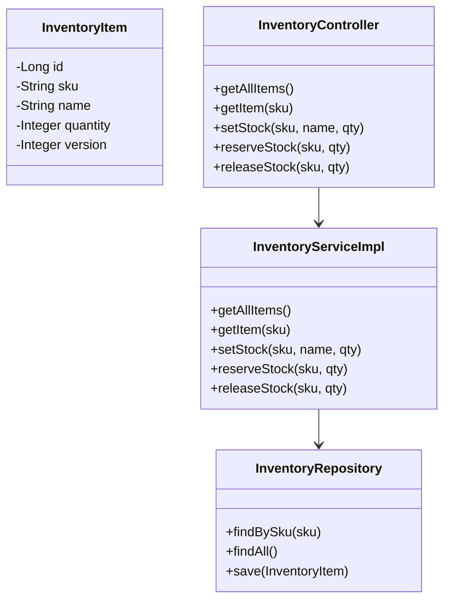

# 📦 Inventory Prototype Service

[](https://www.oracle.com/java/technologies/javase/jdk17-archive-downloads.html)
[](https://spring.io/projects/spring-boot)
[](https://www.sqlite.org/)
[](https://www.h2database.com/)

## 📋 Descripción

Microservicio encargado de la gestión del inventario de productos.  
Permite **consultar stock**, **crear/actualizar inventario**, **reservar unidades** y **liberar stock**.  

Implementa consistencia mediante *optimistic locking* con `@Version` y expone endpoints REST con buenas prácticas JSON.

## 🛠️ Tecnologías y Dependencias Clave

- **Spring Boot 3.5.6**
- **Spring Data JPA**: Persistencia de inventario.
- **Spring Web**: Endpoints REST.
- **Spring Validation**: Validación de entradas.
- **SQLite (Local)** y **H2 (Test)**.
- **Spring Boot Actuator**: Health checks y métricas.
- **JUnit 5 + MockMvc**: Pruebas unitarias e integración.
- **Lombok** (opcional): Reducción de código repetitivo.

## ⚙️ Configuración de Perfiles

- **local** → usa SQLite (archivo `inventory.db`).
- **test** → usa H2 en memoria.
- **docker** → pensado para levantar en contenedor.

### Archivos
- `application-local.yml`
- `application-test.yml`
- `application-docker.yml`

## 📐 Endpoints Principales

- **GET** `/api/inventory` → Listar todo el inventario.
- **GET** `/api/inventory/{sku}` → Consultar un ítem por SKU.
- **POST** `/api/inventory?sku=...&name=...&quantity=...` → Crear o actualizar stock.
- **POST** `/api/inventory/{sku}/reserve?quantity=...` → Reservar stock.
- **POST** `/api/inventory/{sku}/release?quantity=...` → Liberar stock.

## 🔐 Seguridad: Todos los endpoints requieren la cabecera:

X-API-KEY: INVENTORY_SERVICE_KEY

## 📐 Diagrama Simplificado


## 🚀 Ejecución

### 🧪 Local

```bash
mvn clean install
mvn spring-boot:run -Dspring-boot.run.profiles=local
```
Disponible en: http://localhost:8080/api/inventory

## 🐳 Docker
```bash
docker build -t inventory-service .
docker run -p 8081:8081 inventory-service
```

## 🧪 Pruebas
```bash
mvn test
```
Cubre tanto unit tests como integration tests con H2.

## 📊 Observabilidad

Health: GET /actuator/health

Info: GET /actuator/info

## 📄 Notas

Consistencia manejada con optimistic locking (@Version).

Simulación distribuida: cada tienda podría tener un microservicio con su propia DB SQLite sincronizada contra un servicio central.

IA generativa usada para acelerar generación de código, pruebas y documentación (prompts.md incluido).

## 📄 Licencia
Este proyecto está licenciado bajo la Licencia "".
